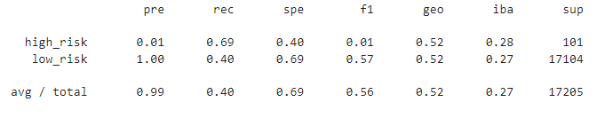
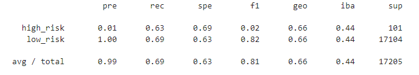
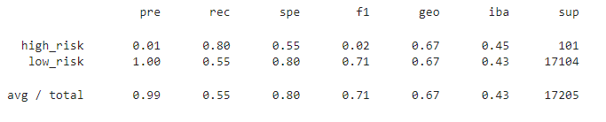
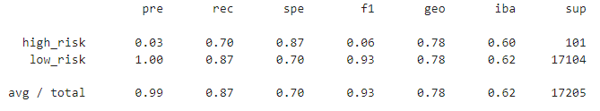
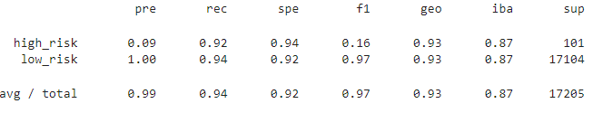

# Credit_Risk_Analysis

## Overview of the loan prediction risk analysis:

The purpose of this assignment was to review loan data and determine whether a loan would be considered high risk or low risk given all factors given. To perform this analysis, we ran 6 supervised machine learning models. 

## Results:

1. Naive Random Oversampling 
- Balanced Accuracy Score was 0.6514
- For high risk loans, the precision and recall was 0.01 and 0.69 respectively. For low risk loans, the precision and recall was 1.00 and 0.40 respectively. 

2. SMOTE Oversampling
- Balanced Accuracy Score was 0.6628
- For high risk loans, the precision and recall was 0.01 and 0.63 respectively. For low risk loans, the precision and recall was 1.00 and 0.69 respectively. 

3. Undersamplings via Cluster Centroids

- Balanced Accuracy Score was 0.5439
- For high risk loans, the precision and recall was 0.01 and 0.69 respectively. For low risk loans, the precision and recall was 1.00 and 0.39 respectively. 

4. SMOTEEN Sampling

- Balanced Accuracy Score was 0.6776
- For high risk loans, the precision and recall was 0.01 and 0.80 respectively. For low risk loans, the precision and recall was 1.00 and 0.55 respectively. 

5. Balanced Random Forest Classifer

- Balanced Accuracy Score was 0.7885
- For high risk loans, the precision and recall was 0.03 and 0.70 respectively. For low risk loans, the precision and recall was 1.00 and 0.69 respectively. 

6. Easy Ensemble AdaBoost Classifier 

- Balanced Accuracy Score was 0.93166
- For high risk loans, the precision and recall was 0.09 and 0.92 respectively. For low risk loans, the precision and recall was 1.00 and 0.94 respectively. 

## Summary:

All six models have precision when determining low risk loans but as high risk is the minority data set, that is to be expected. Unfortunately all six models have low precision for high risk loans. This indicates that there will be a high risk of false positives. The recall values range from 0.63 to 0.92 for the models. Lower values indicate a risk for larger number of false negatives. 

For this particular excercise, it would be more beneficial to ensure we are identifying as many high risk as possible. Identifying some low risk as high risk is not nearly as detrimental as classifying high risk as low risk.  As such a more accurate recall would be beneficial. 

Looking at the models, while they are all not particularly great, the only model remotely okay would be the Easy Ensemble AdaBoost Classifier. That model had a recall score of 0.92 and precision of 0.09. Of the 101 high risk loans, it missed 8 but did correctly identify the 93. That being said, it incorrectly classified 983 loans as high risk when they were not. The other models have both inaccuracy and do not seem to capture enough of the high risk loans to be part of the recommendation. 

